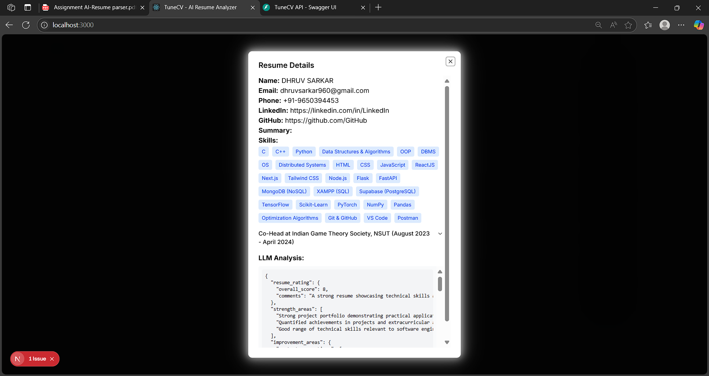

# TuneCV – AI-Powered Resume Analyzer

TuneCV is a full-stack web application that allows users to upload their resumes and receive instant, actionable feedback and upskilling suggestions powered by AI. The project consists of a **FastAPI** backend and a **Next.js/React** frontend.

---

## Features

- Upload your resume (PDF, DOCX)
- Get AI-powered feedback and suggestions
- View history of past uploads and details in a modal
- Modern, responsive UI with smooth tab navigation

---

## Project Structure

```
.
├── app/                # FastAPI backend
│   └── main.py         # Backend entry point
├── frontend/           # Next.js frontend
│   └── src/app/        # Main frontend app code
├── requirements.txt    # Python backend dependencies
└── README.md           # Project documentation
```

---

## Prerequisites

- **Node.js** (v18+ recommended)
- **Python** (v3.9+ recommended)
- **PostgreSQL** (or update DB settings as needed)

---

## Backend Setup (FastAPI)

1. **Install dependencies:**
   ```bash
   pip install -r requirements.txt
   ```

2. **Configure environment variables:**
   - Make a file `.env` and set your database and API keys.
     

3. **Run the backend server:**
   ```bash
   cd app
   uvicorn main:app --reload
   ```
   The API will be available at [http://localhost:8000](http://localhost:8000).

---

## Frontend Setup (Next.js)

1. **Install dependencies:**
   ```bash
   cd frontend
   npm install
   ```

2. **Run the development server:**
   ```bash
   npm run dev
   ```
   The app will be available at [http://localhost:3000](http://localhost:3000).

---

## Usage

- Open [http://localhost:3000](http://localhost:3000) in your browser.
- Click **Get Started** to upload a resume and receive feedback.
- Click **View Past Uploads** to see your upload history and view details in a modal.

---

## Output Screenshots

Below are some screenshots demonstrating the key features and user interface of TuneCV:

| Home Page | Resume Upload | Upload Output |
|-----------|--------------|---------------|
|  |  |  |

| LLM Analysis | Upload History | Resume Details |
|--------------|---------------|----------------|
|  |  |  |

- The **Home Page** welcomes users and provides navigation.
- **Resume Upload** allows users to submit their resume for analysis.
- **Upload Output** shows instant AI-powered feedback and suggestions.
- **LLM Analysis** displays detailed insights from the language model.
- **Upload History** lets users view past uploads.
- **Resume Details** provides a modal with in-depth feedback for each resume.

---

## Technologies Used

- **Frontend:** Next.js, React, Tailwind CSS, Shadcn UI
- **Backend:** FastAPI, SQLAlchemy, PostgreSQL, LangChain, Google Generative AI

---

## Future Scope

TuneCV can be further enhanced with the following features:

- **User Accounts & Login:** Allow users to create accounts, securely log in, and manage their resume analysis history across devices.
- **Custom Resume Tailoring:** Enable users to generate or tailor resumes for specific job roles, industries, or companies using AI.
- **Job Listings Integration:** Provide personalized job recommendations and allow users to apply directly from the platform.
- **Skill Gap Analysis:** Offer detailed insights into missing skills for targeted roles and suggest relevant courses or certifications.
- **Collaboration Tools:** Let users share resumes with mentors, peers, or recruiters for feedback and review.
- **Advanced Analytics:** Visualize career progress, skill development, and benchmarking against industry standards.
- **Multi-Language Support:** Analyze and provide feedback on resumes in multiple languages.
- **Mobile App:** Develop a mobile version for on-the-go resume analysis and feedback.

These enhancements will make TuneCV a comprehensive platform for career development and job readiness.

---

## Contributing

Pull requests are welcome! For major changes, please open an issue first to discuss what you would like to change.

---
